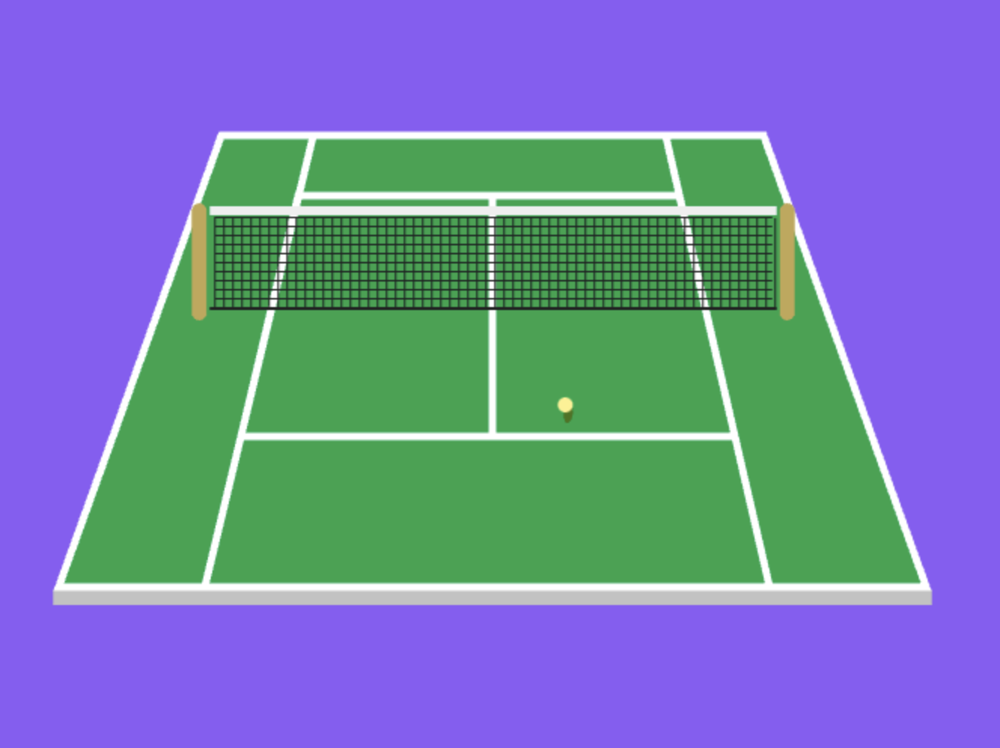

# HTML5 Canvas Tennis Court
> Tennis always begins with love 🎾 ❤️
> 
A creative coding project to programatically display a tennis court in a 1 point perspective view.

I grew up watching and playing tennis so I wanted to do a creative coding project to pay homage to a great sport.





## Demo

Check it out for yourself at https://tennis-starts-with-love.netlify.app/


## Tech Stack
* HTML5 Canvas
* TypeScript
* [math.js library](https://mathjs.org/)
* Vite


## Run Locally

Clone the project

```bash
  git clone https://github.com/chadchristensen/tennis-canvas.git
```

Go to the project directory

```bash
  cd tennis-canvas
```

Install dependencies

```bash
  npm install
```

Start the server

```bash
  npm run dev
```


## Acknowledgements

  - [Generative Art: Two Point Perspective Building on JavaScript Canvas - YouTube Video](https://www.youtube.com/watch?v=U_mIUX2Kg4c)
 - [math.js](https://mathjs.org/)


## Roadmap

- [ ]  Responsiveness
- [ ]  Add color palettes for all 4 Grand Slam tournaments (Australian Open, French Open, Wimbledon, U.S. Open) and allow user to change selection.  It should default to any current tournament.
- [ ]  Allow interactivity with the tennis ball

